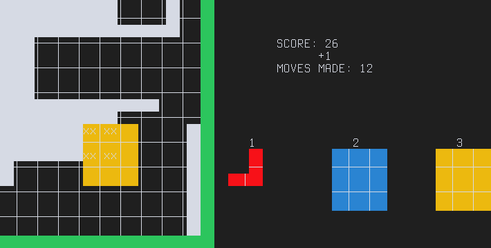

1010
====

    /***********************/
    /*** 1010            ***/
    /*** by trosh        ***/
    /*** Fun times in C! ***/
    /*** Original game   ***/
    /*** by Gram Games   ***/
    /***********************/

How to build
------------

    make

Needs ncurses

How to run
----------

    make run

or

    ./1010

Controls
--------

- `1` `2` or `3` to choose block
- `→` `↑` `←` or `↓` to move block
- `⏎` or `␣` to place block
- `,` or `<` to select previous block
- `.` or `>` to select next block
- `Esc` or `q` to quit
