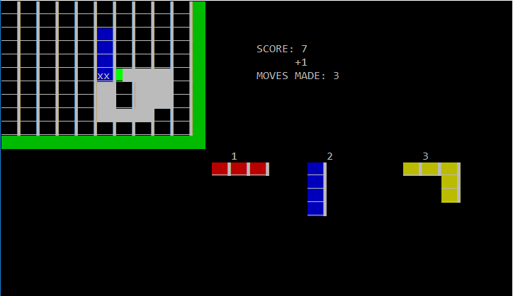

1010
====

    /***********************/
    /*** 1010 COPY       ***/
    /*** BY TROSH        ***/
    /*** FUN TIMES IN C! ***/
    /*** ORIGINAL GAME   ***/
    /*** BY GRAM GAMES   ***/
    /***********************/

HOW TO BUILD
------------

    make

NEEDS NCURSES

HOW TO RUN
----------

    make run

OR

    ./1010

CONTROLS
--------

- **1/2/3** TO CHOOSE BLOCK
- **ARROW KEYS** TO MOVE BLOCK
- **SPACE/RETURN** TO PLACE BLOCK
- **ESCAPE/Q** TO QUIT

KNOWN BUGS
----------

- SOMETIMES DETECTS LOSS WHEN THERE ARE STILL
  SOME POSSIBLE MOVES (NO IDEA WHY)
- WHEN MOVING THE CURRENT BLOCK AROUND, IT CAN
  HANG OVER THE BOTTOM/RIGHT EDGES IF IT OVERLAPS
  WITH AN EXISTING BLOCK (MUST REORDER FITBK)

